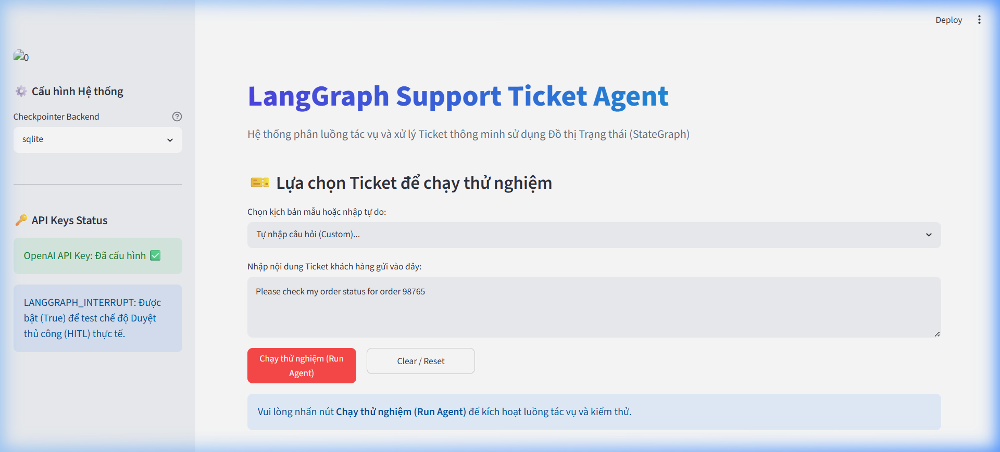

# Day 08 Lab Report

## 1. Team / student

- Name: Hoàng Kim Tuấn Anh
- Repo/commit: [Tuananh458/](https://github.com/AI20K-Build-Cohort-2/C2-App-067.git)phase2-track3-day8-langgraph-agent
- Date: 2026-06-29

## 2. Architecture

We constructed a LangGraph-based workflow for routing and resolving support tickets. The workflow coordinates natural language query classification, tool invocation, result evaluation, retry fallback loops, and human-in-the-loop (HITL) approval gates.

**Graph Components:**
- **intake**: Normalizes input query.
- **classify**: Structured LLM classification of incoming requests.
- **tool**: Executes lookup or operations (supporting simulated failures).
- **evaluate**: LLM-as-judge evaluation of tool correctness, guiding retry routing.
- **answer**: Context-grounded response generation.
- **clarify**: Requests missing parameters/clarification.
- **risky_action**: Prepares description of sensitive actions.
- **approval**: HITL gate pausing execution (via interrupt) or auto-approving.
- **retry**: Bounded retry loop management.
- **dead_letter**: Apologizes and escalates when retries are exhausted.
- **finalize**: Workflow audit logger.

## 3. State schema

| Field | Reducer | Why |
|---|---|---|
| query | overwrite | Tracks user's request |
| route | overwrite | Target category chosen by classifier |
| risk_level | overwrite | High or Low based on classification |
| attempt | overwrite | Tracks count of tool invocations |
| max_attempts | overwrite | Limit on retry loops |
| final_answer | overwrite | Ultimate output response |
| evaluation_result | overwrite | Loop routing decision (success/needs_retry) |
| pending_question | overwrite | Clarification query text |
| proposed_action | overwrite | Action description prepared for review |
| approval | overwrite | Human or mock approval payload |
| messages | append | Conversation log audit |
| tool_results | append | Aggregated mock tool outputs |
| errors | append | Cumulative errors during retries |
| events | append | Audit event checkpoints for monitoring |

## 4. Scenario results

| Scenario | Expected route | Actual route | Success | Retries | Interrupts |
|---|---|---|---:|---:|---:|
| S01_simple | simple | simple | Yes | 0 | 0 |
| S02_tool | tool | tool | Yes | 0 | 0 |
| S03_missing | missing_info | missing_info | Yes | 0 | 0 |
| S04_risky | risky | risky | Yes | 0 | 1 |
| S05_error | error | error | Yes | 2 | 0 |
| S06_delete | risky | risky | Yes | 0 | 1 |
| S07_dead_letter | error | error | Yes | 1 | 0 |

Below is a screenshot of the Streamlit dashboard metrics demonstrating a completed ticket run and the corresponding state evaluation:

## 5. Failure analysis

1. **Retry or tool failure**:
If a tool execution fails, the state transitions to `evaluate`. The evaluation marks it as `needs_retry`, leading to `retry_or_fallback` which increments the attempt count. If the attempt reaches `max_attempts`, routing triggers `dead_letter` instead of looping infinitely.

2. **Risky action without approval**:
Risky classifications (like refunds/deletions) must route through `approval`. The graph pauses on `approval` if interrupts are active. Without approval, the ticket is not executed and instead routed to `clarify` (clarification) upon rejection.

## 6. Persistence / recovery evidence

We enabled `SqliteSaver` in `persistence.py`. Using a `thread_id` for every unique scenario ensures that ticket status is preserved across runs. When an interrupt is raised at the `approval` node (via `LANGGRAPH_INTERRUPT=true`), the graph state is saved in the SQLite db and resumes successfully upon submitting the decision.

## 7. Extension work

- **SQLite Checkpointer**: Configured `SqliteSaver` using Python's sqlite3 connection in WAL mode for persistent checkpointing.
- **LLM-as-Judge Evaluation**: Structured LLM evaluation in `evaluate_node` to determine success/retry needs of tool outcomes.

## 8. Improvement plan

1. **Parallel Execution**: Leverage LangGraph's `Send` mechanism to trigger multiple lookup tools simultaneously.
2. **Interactive UI**: Develop a dashboard showing pending approvals and allowing human agents to resume thread runs.
3. **Advanced Time Travel**: Integrate historical state inspection CLI commands to allow developers to replay state transitions.
